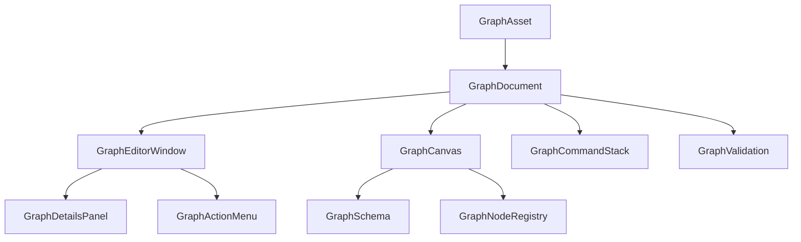

# AiluEngine 节点编辑器开发文档

## 1. 文档目的

本文档用于指导在 **AiluEngine** 中实现一个通用节点编辑器框架。编辑器外观和核心交互参考 Unreal
Engine Blueprint，但首期目标不是复制完整 Blueprint 系统，而是建立可复用的节点图基础设施，后续可用于：

- Flow Graph / 可视化脚本
- Material Graph
- Animation Graph
- Behavior Tree
- Render Graph 调试与编辑
- 状态机
- 对话树和任务图

实现必须适配 AiluEngine 现有架构：

- 编辑器窗口使用 `DockWindow`
- 编辑器 UI 使用 Ailu 自研 `UI::Widget` / `UI::UIElement`
- 绘制使用 `UI::UIRenderer`
- 资产系统使用 `Object`、`ResourceMgr` 和 `.alasset`
- 序列化使用反射系统、`APROPERTY`、`FArchive`
- 编辑器支持 `Apply`、`Revert`、Dirty State
- 编辑器已有通用命令接口 `ICommand`
- Engine 已集成 `imnodes`，但正式版本不直接依赖 `imnodes` 作为主画布

本文档默认首个落地类型为 `FlowGraphAsset`，用于验证编辑器和运行时链路。

---

## 2. 总体结论

正式节点编辑器使用：

> `UI::GraphCanvas` 原生画布 + 独立 Graph 数据模型 + Graph Schema + Node Registry。

现有 `imnodes` 只允许用于快速交互原型或调试工具，不作为正式资产编辑器的最终实现。

主要原因：

1. `imnodes` 属于 ImGui 输入和绘制体系，AiluEngine 正式编辑器已经使用自研 UI 和 Dock 系统。
2. 原生 `GraphCanvas` 可以自然使用 Ailu UI 的裁剪、焦点、事件冒泡、样式和多窗口能力。
3. Blueprint 风格编辑器需要复杂节点内容、浮层输入、运行时高亮、错误提示和自定义 LOD。
4. 直接使用 `imnodes` 会导致输入捕获、坐标、DockWindow、浮动窗口和 Ailu UI Theme 两套体系并存。
5. AiluEngine 已经存在 `SpritePreviewWidget` 这种自定义交互式画布模式，可以直接复用该设计思路。

---

## 3. 范围

### 3.1 首期必须完成

- 通用 Graph 数据结构
- 节点、Pin、Link 稳定 ID
- Graph Schema 连接规则
- Node Registry
- 原生 GraphCanvas
- 网格、平移、缩放
- 节点绘制和拖动
- Pin 绘制和连接
- 多选和框选
- 删除、复制、粘贴、复制节点
- Undo / Redo
- 节点搜索菜单
- 从 Pin 拖到空白处创建兼容节点
- GraphAsset 序列化
- GraphEditorWindow
- AssetBrowser 打开 GraphAsset
- 编辑器 Dirty、Apply、Revert、Save
- 基本验证和错误提示

### 3.2 首期不实现

- 完整 Blueprint VM
- 蓝图类继承
- 网络复制
- latent action
- Blueprint macro
- Blueprint interface
- 图内函数重载解析
- 复杂泛型 Pin
- 节点调试器和断点
- 自动布局
- 多人协作编辑
- Graph diff
- Graph merge
- GPU Graph 编译
- Material Graph Shader 编译

这些功能需要在通用 Graph Framework 稳定后单独设计。

---

## 4. 设计原则

### 4.1 数据与显示分离

GraphAsset 只保存持久化数据。

GraphCanvas 只负责显示和交互。

GraphDocument 负责编辑会话、查找索引、Dirty、命令和资产同步。

GraphSchema 负责语义规则。

GraphNodeRegistry 负责节点类型注册和创建。

### 4.2 资产数据不能依赖源码行号

持久化的节点类型 ID 不允许使用：

- `__LINE__`
- 编译期声明顺序
- 运行期地址
- 非稳定的自增 Type ID

推荐使用稳定字符串：

```text
Flow.Entry
Flow.Branch
Flow.Print
Math.AddFloat
Variable.Get
Variable.Set
```

或者使用显式定义的稳定 Guid。

### 4.3 编辑器状态与资产状态分离

资产保存：

- 节点 ID
- 节点类型
- 节点位置
- 节点属性
- Pin
- Link
- 注释框
- Reroute

用户编辑器状态保存：

- 画布平移
- 画布缩放
- 左右面板宽度
- MiniMap 开关
- 展开的分类
- 最近搜索

临时状态不保存：

- 当前 Hover
- 当前 Drag
- 框选矩形
- 待创建连线
- 当前弹出菜单
- 当前选择，首期可以不恢复

### 4.4 不为每个普通节点创建完整 UIElement 树

`GraphCanvas` 应批量绘制普通节点、Pin、文字和连线。

只在以下情况临时创建 Ailu UI 控件：

- 编辑文本
- 编辑数字
- 下拉框
- 颜色选择器
- 资产选择器
- 节点搜索菜单
- Tooltip
- Context Menu

这样可以避免数百节点导致大量 UIElement、布局和缓存失效。

---

## 5. 模块划分

建议增加以下目录。

```text
Engine/Inc/Graph/
    GraphAsset.h
    GraphTypes.h
    GraphSchema.h
    GraphNodeRegistry.h
    GraphValidation.h
    GraphRuntime.h

Engine/Src/Graph/
    GraphAsset.cpp
    GraphSchema.cpp
    GraphNodeRegistry.cpp
    GraphValidation.cpp
    GraphRuntime.cpp

Editor/Inc/Graph/
    GraphEditorWindow.h
    GraphCanvas.h
    GraphDocument.h
    GraphCommands.h
    GraphClipboard.h
    GraphEditorStyle.h
    GraphActionMenu.h
    GraphDetailsPanel.h

Editor/Src/Graph/
    GraphEditorWindow.cpp
    GraphCanvas.cpp
    GraphDocument.cpp
    GraphCommands.cpp
    GraphClipboard.cpp
    GraphEditorStyle.cpp
    GraphActionMenu.cpp
    GraphDetailsPanel.cpp

Engine/Inc/Graph/Flow/
    FlowGraphAsset.h
    FlowGraphSchema.h
    FlowGraphRuntime.h
    FlowGraphNodes.h

Engine/Src/Graph/Flow/
    FlowGraphAsset.cpp
    FlowGraphSchema.cpp
    FlowGraphRuntime.cpp
    FlowGraphNodes.cpp
```

如果首期不实现运行时，可以先省略：

```text
GraphRuntime.*
FlowGraphRuntime.*
```

---

## 6. 核心架构



### 6.1 职责

#### GraphAsset

负责可序列化图数据。

#### GraphDocument

负责当前打开资产的编辑副本和索引。

#### GraphCanvas

负责节点图显示、输入和交互状态机。

#### GraphSchema

负责 Pin 兼容、连接规则和可创建节点过滤。

#### GraphNodeRegistry

负责节点描述注册和节点实例初始化。

#### GraphCommandStack

负责 Graph 编辑器独立 Undo / Redo。

#### GraphValidation

负责图完整性和语义验证。

#### GraphEditorWindow

负责工具栏、Palette、Canvas、Details 和状态栏。

---

## 7. 数据结构

## 7.1 基础枚举

```cpp
#pragma once

namespace Ailu
{
    enum class EGraphPinDirection : u8
    {
        kInput,
        kOutput
    };

    enum class EGraphPinKind : u8
    {
        kExecution,
        kValue
    };

    enum class EGraphNodeFlag : u32
    {
        kNone = 0u,
        kCanDelete = 1u << 0u,
        kCanDuplicate = 1u << 1u,
        kCanRename = 1u << 2u,
        kCanCollapse = 1u << 3u,
        kEntryNode = 1u << 4u,
        kPureNode = 1u << 5u
    };

    enum class EGraphLinkFlag : u32
    {
        kNone = 0u,
        kDisabled = 1u << 0u
    };
}
```

需要提供位运算辅助函数。

---

## 7.2 GraphPinData

```cpp
ASTRUCT()
struct AILU_API GraphPinData
{
    GENERATED_BODY()

    APROPERTY()
    Guid _id = Guid::EmptyGuid();

    APROPERTY()
    String _name;

    APROPERTY()
    String _value_type;

    APROPERTY()
    EGraphPinDirection _direction = EGraphPinDirection::kInput;

    APROPERTY()
    EGraphPinKind _kind = EGraphPinKind::kValue;

    APROPERTY()
    String _default_value;

    APROPERTY()
    bool _is_hidden = false;

    APROPERTY()
    bool _is_dynamic = false;
};
```

说明：

- `_id` 是 Pin 实例稳定 Guid。
- `_value_type` 使用稳定字符串，例如 `bool`、`float`、`Vector3f`、`Entity`。
- `_default_value` 首期使用字符串序列化，后续可替换为 Variant。
- Execution Pin 的 `_value_type` 固定为空或 `exec`。
- `_is_dynamic` 表示运行时或节点属性可增删的 Pin。

---

## 7.3 GraphNodeData

```cpp
ASTRUCT()
struct AILU_API GraphNodeData
{
    GENERATED_BODY()

    APROPERTY()
    Guid _id = Guid::EmptyGuid();

    APROPERTY()
    String _node_type;

    APROPERTY()
    String _display_name;

    APROPERTY()
    Vector2f _position = Vector2f::kZero;

    APROPERTY()
    Vector2f _size = {180.0f, 100.0f};

    APROPERTY()
    Vector<GraphPinData> _pins;

    APROPERTY()
    String _property_data;

    APROPERTY()
    u32 _flags = static_cast<u32>(EGraphNodeFlag::kCanDelete) |
                 static_cast<u32>(EGraphNodeFlag::kCanDuplicate);

    APROPERTY()
    bool _is_collapsed = false;
};
```

`_property_data` 首期可以保存节点扩展数据的 JSON 字符串。

推荐后续替换为：

```cpp
Ref<SerializeObject> _node_properties;
```

但前提是当前反射和多态序列化已经稳定支持通过类型创建对象。

---

## 7.4 GraphLinkData

```cpp
ASTRUCT()
struct AILU_API GraphLinkData
{
    GENERATED_BODY()

    APROPERTY()
    Guid _id = Guid::EmptyGuid();

    APROPERTY()
    Guid _output_pin = Guid::EmptyGuid();

    APROPERTY()
    Guid _input_pin = Guid::EmptyGuid();

    APROPERTY()
    u32 _flags = static_cast<u32>(EGraphLinkFlag::kNone);
};
```

必须保证：

- `_output_pin` 总是 Output Pin。
- `_input_pin` 总是 Input Pin。
- 不允许保存 Node ID 代替 Pin ID。
- 删除节点时必须删除所有引用其 Pin 的 Link。

---

## 7.5 GraphCommentData

```cpp
ASTRUCT()
struct AILU_API GraphCommentData
{
    GENERATED_BODY()

    APROPERTY()
    Guid _id = Guid::EmptyGuid();

    APROPERTY()
    String _title = "Comment";

    APROPERTY()
    Vector2f _position = Vector2f::kZero;

    APROPERTY()
    Vector2f _size = {400.0f, 240.0f};

    APROPERTY()
    Color _color = {0.2f, 0.4f, 0.8f, 0.25f};
};
```

Comment 首期可以推迟到基础节点交互完成后实现。

---

## 7.6 GraphAsset

```cpp
ACLASS()
class AILU_API GraphAsset : public Object
{
    GENERATED_BODY()

public:
    GraphAsset();
    explicit GraphAsset(const String &name);

    const Vector<GraphNodeData> &Nodes() const { return _nodes; }
    const Vector<GraphLinkData> &Links() const { return _links; }
    const Vector<GraphCommentData> &Comments() const { return _comments; }

    Vector<GraphNodeData> &MutableNodes() { return _nodes; }
    Vector<GraphLinkData> &MutableLinks() { return _links; }
    Vector<GraphCommentData> &MutableComments() { return _comments; }

    u32 Version() const { return _version; }

private:
    APROPERTY()
    u32 _version = 1u;

    APROPERTY()
    String _schema_type;

    APROPERTY()
    Vector<GraphNodeData> _nodes;

    APROPERTY()
    Vector<GraphLinkData> _links;

    APROPERTY()
    Vector<GraphCommentData> _comments;
};
```

`_schema_type` 示例：

```text
FlowGraphSchema
MaterialGraphSchema
AnimationGraphSchema
```

---

## 8. GraphNodeRegistry

## 8.1 目标

Node Registry 用于注册节点类型，不允许 GraphCanvas 写死节点类列表。

```cpp
struct GraphPinDesc
{
    String _name;
    String _value_type;
    EGraphPinDirection _direction = EGraphPinDirection::kInput;
    EGraphPinKind _kind = EGraphPinKind::kValue;
    String _default_value;
};

struct GraphNodeDesc
{
    String _type_id;
    String _display_name;
    String _category;
    String _tooltip;
    Color _title_color;
    Vector2f _default_size = {180.0f, 100.0f};
    Vector<GraphPinDesc> _pins;
    u32 _flags = 0u;
};

class AILU_API GraphNodeRegistry
{
public:
    static GraphNodeRegistry &Get();

    bool RegisterNode(GraphNodeDesc desc);
    const GraphNodeDesc *FindNode(StringView type_id) const;
    Vector<const GraphNodeDesc *> FindNodes(StringView search_text) const;
    Vector<const GraphNodeDesc *> FindNodesByCategory(StringView category) const;

    bool InitializeNode(StringView type_id, GraphNodeData &node) const;

private:
    HashMap<String, GraphNodeDesc> _node_descs;
};
```

## 8.2 注册示例

```cpp
void RegisterFlowGraphNodes()
{
    GraphNodeDesc entry;
    entry._type_id = "Flow.Entry";
    entry._display_name = "Entry";
    entry._category = "Flow";
    entry._tooltip = "Graph execution entry point.";
    entry._title_color = {0.8f, 0.15f, 0.1f, 1.0f};
    entry._flags = static_cast<u32>(EGraphNodeFlag::kEntryNode);
    entry._pins.push_back({"Then", "", EGraphPinDirection::kOutput, EGraphPinKind::kExecution, ""});
    GraphNodeRegistry::Get().RegisterNode(std::move(entry));

    GraphNodeDesc branch;
    branch._type_id = "Flow.Branch";
    branch._display_name = "Branch";
    branch._category = "Flow";
    branch._tooltip = "Chooses an execution path based on a boolean condition.";
    branch._title_color = {0.2f, 0.55f, 0.25f, 1.0f};
    branch._pins.push_back({"Exec", "", EGraphPinDirection::kInput, EGraphPinKind::kExecution, ""});
    branch._pins.push_back({"Condition", "bool", EGraphPinDirection::kInput, EGraphPinKind::kValue, "false"});
    branch._pins.push_back({"True", "", EGraphPinDirection::kOutput, EGraphPinKind::kExecution, ""});
    branch._pins.push_back({"False", "", EGraphPinDirection::kOutput, EGraphPinKind::kExecution, ""});
    GraphNodeRegistry::Get().RegisterNode(std::move(branch));
}
```

## 8.3 初始化节点

```cpp
bool GraphNodeRegistry::InitializeNode(StringView type_id, GraphNodeData &node) const
{
    const GraphNodeDesc *desc = FindNode(type_id);
    if (desc == nullptr)
        return false;

    node._id = Guid::Generate();
    node._node_type = desc->_type_id;
    node._display_name = desc->_display_name;
    node._size = desc->_default_size;
    node._flags = desc->_flags;
    node._pins.clear();
    node._pins.reserve(desc->_pins.size());

    for (const GraphPinDesc &pin_desc : desc->_pins)
    {
        GraphPinData pin;
        pin._id = Guid::Generate();
        pin._name = pin_desc._name;
        pin._value_type = pin_desc._value_type;
        pin._direction = pin_desc._direction;
        pin._kind = pin_desc._kind;
        pin._default_value = pin_desc._default_value;
        node._pins.push_back(std::move(pin));
    }
    return true;
}
```

---

## 9. GraphSchema

## 9.1 连接返回值

```cpp
enum class EGraphConnectionAction : u8
{
    kDisallow,
    kAllow,
    kReplaceInput,
    kInsertConversion
};

struct GraphConnectionResponse
{
    EGraphConnectionAction _action = EGraphConnectionAction::kDisallow;
    String _message;
    String _conversion_node_type;

    static GraphConnectionResponse Allow()
    {
        return {EGraphConnectionAction::kAllow, "", ""};
    }

    static GraphConnectionResponse Disallow(String message)
    {
        return {EGraphConnectionAction::kDisallow, std::move(message), ""};
    }
};
```

## 9.2 Schema 接口

```cpp
class AILU_API IGraphSchema
{
public:
    virtual ~IGraphSchema() = default;

    virtual GraphConnectionResponse CanConnect(const GraphDocument &document, const GraphPinData &source,
                                               const GraphPinData &target) const = 0;

    virtual void CollectNodeActions(const GraphDocument &document, const GraphPinData *source_pin,
                                    Vector<GraphNodeAction> &actions) const = 0;

    virtual bool CanDeleteNode(const GraphDocument &document, const GraphNodeData &node) const;
    virtual bool CanCreateNode(const GraphDocument &document, StringView node_type) const;
    virtual bool AllowsCycles() const;
};
```

## 9.3 基础连接规则

默认规则：

1. Pin 不允许连接自己。
2. 必须一个 Input、一个 Output。
3. Execution Pin 只能连接 Execution Pin。
4. Value Pin 只能连接 Value Pin。
5. Value 类型必须相同，或者 Schema 明确允许转换。
6. Input Pin 默认只允许一条连接。
7. Output Pin 默认允许多条连接。
8. 已连接的 Input Pin 再次连接时返回 `kReplaceInput`。
9. 如果图不允许环，创建连接前必须检查环。
10. 禁止连接同一节点上的特定 Pin 时由派生 Schema 处理。

## 9.4 FlowGraphSchema 示例

```cpp
class FlowGraphSchema final : public IGraphSchema
{
public:
    GraphConnectionResponse CanConnect(const GraphDocument &document, const GraphPinData &source,
                                       const GraphPinData &target) const override;

    void CollectNodeActions(const GraphDocument &document, const GraphPinData *source_pin,
                            Vector<GraphNodeAction> &actions) const override;

    bool AllowsCycles() const override { return true; }
};
```

---

## 10. GraphDocument

## 10.1 目标

GraphDocument 是 Graph 编辑器最重要的中间层。

它不负责绘制，但负责：

- 编辑副本
- 查找索引
- Dirty
- Apply / Revert
- 命令栈
- 创建和删除节点
- 创建和删除连接
- Graph Schema
- Validation
- 选中对象对应的属性修改

## 10.2 接口

```cpp
class GraphCommandStack;

class AILU_EDITOR_API GraphDocument
{
public:
    GraphDocument();
    ~GraphDocument();

    bool Open(GraphAsset *asset);
    void Close();

    bool Apply();
    void Revert();

    bool IsDirty() const;
    GraphAsset *Asset() const { return _asset; }

    const Vector<GraphNodeData> &Nodes() const { return _editing_nodes; }
    const Vector<GraphLinkData> &Links() const { return _editing_links; }

    GraphNodeData *FindNode(const Guid &node_id);
    const GraphNodeData *FindNode(const Guid &node_id) const;

    GraphPinData *FindPin(const Guid &pin_id);
    const GraphPinData *FindPin(const Guid &pin_id) const;

    GraphLinkData *FindLink(const Guid &link_id);
    const GraphLinkData *FindLink(const Guid &link_id) const;

    GraphNodeData *FindNodeByPin(const Guid &pin_id);
    const GraphNodeData *FindNodeByPin(const Guid &pin_id) const;

    Vector<const GraphLinkData *> FindLinksForPin(const Guid &pin_id) const;
    Vector<const GraphLinkData *> FindLinksForNode(const Guid &node_id) const;

    Guid AddNode(StringView node_type, Vector2f position);
    bool RemoveNodes(std::span<const Guid> node_ids);

    GraphConnectionResponse CanConnect(const Guid &first_pin, const Guid &second_pin) const;
    Guid AddLink(const Guid &first_pin, const Guid &second_pin);
    bool RemoveLinks(std::span<const Guid> link_ids);

    IGraphSchema *Schema() const { return _schema.get(); }
    GraphCommandStack &Commands() { return *_command_stack; }

    void RebuildIndices();
    void Validate();

private:
    void MarkDirty();

private:
    GraphAsset *_asset = nullptr;
    Vector<GraphNodeData> _original_nodes;
    Vector<GraphLinkData> _original_links;
    Vector<GraphCommentData> _original_comments;
    Vector<GraphNodeData> _editing_nodes;
    Vector<GraphLinkData> _editing_links;
    Vector<GraphCommentData> _editing_comments;

    HashMap<Guid, u32> _node_index;
    HashMap<Guid, std::pair<u32, u32>> _pin_index;
    HashMap<Guid, u32> _link_index;

    Scope<IGraphSchema> _schema;
    Scope<GraphCommandStack> _command_stack;
    Vector<GraphValidationMessage> _validation_messages;
    bool _is_dirty = false;
};
```

## 10.3 索引

不能每帧遍历所有节点查 Pin。

至少维护：

```text
node_id -> node_index
pin_id -> node_index + pin_index
link_id -> link_index
```

修改节点、Pin、Link 后可以先全量 `RebuildIndices()`。

首期不需要过早做增量更新，正确性优先。

---

## 11. Undo / Redo

## 11.1 不直接使用全局 Scene CommandManager

Graph 编辑器需要每个文档独立的命令栈。

```cpp
class IGraphCommand
{
public:
    virtual ~IGraphCommand() = default;
    virtual void Execute(GraphDocument &document) = 0;
    virtual void Undo(GraphDocument &document) = 0;
    virtual const String &Name() const = 0;
};

class GraphCommandStack
{
public:
    explicit GraphCommandStack(GraphDocument *document);

    void Execute(Scope<IGraphCommand> command);
    void Undo();
    void Redo();
    void Clear();

    bool CanUndo() const;
    bool CanRedo() const;

private:
    GraphDocument *_document = nullptr;
    Vector<Scope<IGraphCommand>> _undo_stack;
    Vector<Scope<IGraphCommand>> _redo_stack;
};
```

## 11.2 命令类型

必须实现：

```text
AddGraphNodeCommand
RemoveGraphNodesCommand
MoveGraphNodesCommand
AddGraphLinkCommand
RemoveGraphLinksCommand
SetGraphNodePropertyCommand
SetGraphPinDefaultValueCommand
PasteGraphElementsCommand
```

后续增加：

```text
ResizeGraphCommentCommand
RenameGraphNodeCommand
AddDynamicPinCommand
RemoveDynamicPinCommand
```

## 11.3 节点拖动命令合并

拖动开始：

```text
保存所有选中节点初始位置
```

拖动中：

```text
直接修改编辑副本中的节点位置
只触发画布重绘
不提交命令
```

拖动结束：

```text
如果位置变化，创建一个 MoveGraphNodesCommand
命令内部保存 before 和 after
```

不能在每次 MouseMove 时创建命令。

## 11.4 文本和数值编辑事务

属性输入获得焦点时保存旧值。

失去焦点或按 Enter 时创建一次命令。

按 Escape 时恢复旧值，不创建命令。

---

## 12. GraphCanvas

## 12.1 类定义

```cpp
enum class EGraphInteractionState : u8
{
    kIdle,
    kPanning,
    kBoxSelecting,
    kDraggingNodes,
    kCreatingLink,
    kDraggingComment,
    kResizingComment
};

class AILU_EDITOR_API GraphCanvas : public UI::UIElement
{
public:
    explicit GraphCanvas(GraphDocument *document);

    Vector2f MeasureDesiredSize() override;
    void Update(f32 dt) override;
    void OnEvent(UI::UIEvent &event) override;

    void SetDocument(GraphDocument *document);
    void FrameAllNodes();
    void FocusSelection();

    f32 Zoom() const { return _zoom; }
    Vector2f ViewOrigin() const { return _view_origin; }

protected:
    void RenderImpl(UI::UIRenderer &renderer) override;

private:
    void DrawBackground(UI::UIRenderer &renderer);
    void DrawGrid(UI::UIRenderer &renderer);
    void DrawComments(UI::UIRenderer &renderer);
    void DrawLinks(UI::UIRenderer &renderer);
    void DrawNodes(UI::UIRenderer &renderer);
    void DrawPendingLink(UI::UIRenderer &renderer);
    void DrawSelectionBox(UI::UIRenderer &renderer);
    void DrawDebugOverlay(UI::UIRenderer &renderer);

    void UpdateHoverState(const Vector2f &mouse_position);
    void HandleMouseDown(UI::UIEvent &event);
    void HandleMouseUp(UI::UIEvent &event);
    void HandleMouseMove(UI::UIEvent &event);
    void HandleMouseScroll(UI::UIEvent &event);
    void HandleKeyDown(UI::UIEvent &event);

    Vector2f GraphToScreen(const Vector2f &position) const;
    Vector2f ScreenToGraph(const Vector2f &position) const;
    Vector4f GraphRectToScreen(const Vector4f &rect) const;

private:
    GraphDocument *_document = nullptr;

    EGraphInteractionState _interaction_state = EGraphInteractionState::kIdle;

    Vector2f _view_origin = Vector2f::kZero;
    f32 _zoom = 1.0f;

    HashSet<Guid> _selected_nodes;
    HashSet<Guid> _selected_links;
    HashSet<Guid> _selected_comments;

    Guid _hovered_node = Guid::EmptyGuid();
    Guid _hovered_pin = Guid::EmptyGuid();
    Guid _hovered_link = Guid::EmptyGuid();
    Guid _hovered_comment = Guid::EmptyGuid();

    Guid _link_drag_source_pin = Guid::EmptyGuid();
    Guid _link_drag_target_pin = Guid::EmptyGuid();

    Vector2f _drag_start_mouse = Vector2f::kZero;
    Vector2f _selection_start = Vector2f::kZero;
    Vector2f _selection_end = Vector2f::kZero;

    HashMap<Guid, Vector2f> _drag_start_node_positions;

    bool _show_grid = true;
    bool _show_minimap = false;
};
```

---

## 12.2 坐标系统

GraphCanvas 使用两种坐标：

### Graph Space

节点持久化位置所在坐标系。

### Screen Space

当前 UI 窗口绝对坐标。

转换：

```cpp
Vector2f GraphCanvas::GraphToScreen(const Vector2f &position) const
{
    const Vector4f content_rect = GetContentRect();
    return content_rect.xy + _view_origin + position * _zoom;
}

Vector2f GraphCanvas::ScreenToGraph(const Vector2f &position) const
{
    const Vector4f content_rect = GetContentRect();
    return (position - content_rect.xy - _view_origin) / _zoom;
}
```

缩放范围：

```cpp
inline static constexpr f32 kMinZoom = 0.25f;
inline static constexpr f32 kMaxZoom = 2.0f;
```

---

## 12.3 以鼠标为中心缩放

滚轮缩放时，鼠标指向的 Graph Space 坐标不能变化。

```cpp
void GraphCanvas::ZoomAt(const Vector2f &screen_position, f32 zoom_delta)
{
    const Vector2f graph_before = ScreenToGraph(screen_position);
    const f32 new_zoom = std::clamp(_zoom * zoom_delta, kMinZoom, kMaxZoom);

    if (NearbyEqual(new_zoom, _zoom))
        return;

    _zoom = new_zoom;

    const Vector4f content_rect = GetContentRect();
    _view_origin = screen_position - content_rect.xy - graph_before * _zoom;
    InvalidatePaint();
}
```

---

## 12.4 网格绘制

绘制两级网格：

```text
次网格：16 Graph Units
主网格：128 Graph Units
```

缩放后网格间距过小时自动跳级，避免密集闪烁。

推荐：

```cpp
f32 grid_step = 16.0f;

while (grid_step * _zoom < 8.0f)
    grid_step *= 2.0f;
```

绘制范围只覆盖画布可见区域。

---

## 12.5 节点布局缓存

GraphCanvas 每帧或 Dirty 时计算节点布局：

```cpp
struct GraphPinVisual
{
    Guid _pin_id;
    Vector2f _center;
    Vector4f _row_rect;
};

struct GraphNodeVisual
{
    Guid _node_id;
    Vector4f _node_rect;
    Vector4f _title_rect;
    Vector<GraphPinVisual> _pins;
    u64 _layout_revision = 0u;
};
```

缓存：

```cpp
HashMap<Guid, GraphNodeVisual> _node_visuals;
```

节点位置或属性变化时只失效对应节点布局。

首期也可以先每帧重算，之后再优化。

---

## 12.6 节点尺寸

首期节点宽度固定，节点高度按 Pin 数计算。

```text
title_height = 28
pin_row_height = 22
body_padding = 8
node_height = title_height + body_padding * 2 + max(input_count, output_count) * pin_row_height
```

最小宽度：

```text
180 px
```

宽节点：

```text
240 px
```

后续支持拖动调整宽度。

---

## 12.7 绘制顺序

必须使用以下顺序：

```text
1. Background
2. Grid
3. Comments
4. Unselected Links
5. Selected Links
6. Unselected Nodes
7. Selected Nodes
8. Pending Link
9. Selection Box
10. Tooltip / Debug Overlay
```

Link 必须绘制在 Node 下方。

Comment 必须绘制在 Node 和 Link 下方。

---

## 12.8 视口裁剪

GraphCanvas 绘制前调用：

```cpp
renderer.PushScissor(GetContentRect());
```

结束时：

```cpp
renderer.PopScissor();
```

只绘制与可见 Rect 相交的节点。

连线首期可以全部绘制，后续增加曲线 Bounds 裁剪。

---

## 13. 贝塞尔连线

## 13.1 UIRenderer 扩展

在 `UIRenderer` 增加：

```cpp
void DrawPolyline(std::span<const Vector2f> points, f32 thickness, Color color, f32 depth = 0.0f);

void DrawCubicBezier(Vector2f p0, Vector2f p1, Vector2f p2, Vector2f p3, f32 thickness,
                     Color color, f32 depth = 0.0f);
```

## 13.2 控制点

```cpp
void BuildGraphLinkBezier(const Vector2f &start, const Vector2f &end, Vector2f &p1, Vector2f &p2)
{
    const f32 horizontal_distance = std::abs(end.x - start.x);
    const f32 tangent = std::clamp(horizontal_distance * 0.5f, 40.0f, 240.0f);

    p1 = start + Vector2f(tangent, 0.0f);
    p2 = end - Vector2f(tangent, 0.0f);
}
```

如果连接从右向左跨越，可以增大 Tangent：

```cpp
if (end.x < start.x)
{
    const f32 vertical_distance = std::abs(end.y - start.y);
    const f32 backward_tangent = std::max(120.0f, vertical_distance * 0.5f);
    p1 = start + Vector2f(backward_tangent, 0.0f);
    p2 = end - Vector2f(backward_tangent, 0.0f);
}
```

## 13.3 曲线采样

首期使用 24 段。

```cpp
Vector2f EvaluateCubicBezier(const Vector2f &p0, const Vector2f &p1, const Vector2f &p2,
                             const Vector2f &p3, f32 t)
{
    const f32 u = 1.0f - t;
    return p0 * (u * u * u) + p1 * (3.0f * u * u * t) + p2 * (3.0f * u * t * t) +
           p3 * (t * t * t);
}
```

后续根据曲线长度动态决定段数：

```cpp
segment_count = clamp(curve_length / 12, 8, 48)
```

## 13.4 曲线命中测试

不能只测试采样点。

首期可以对每一段线段计算鼠标到线段距离：

```cpp
f32 DistancePointToSegment(Vector2f point, Vector2f a, Vector2f b);
```

Hover 阈值：

```text
max(6 px, line_thickness + 4 px)
```

---

## 14. Pin 绘制和颜色

建议颜色：

```text
Execution: White
Bool: Red
Int: Cyan
Float: Green
Vector: Yellow
String: Magenta
Entity/Object: Blue
Asset: Purple
Unknown: Gray
```

创建统一接口：

```cpp
Color GetGraphPinColor(const GraphPinData &pin);
```

Pin 形状：

```text
Execution: 三角形
Value Input: 空心圆
Value Output: 实心圆
Connected Input: 实心圆
```

首期没有三角形绘制接口时，可以全部使用圆形。

---

## 15. 输入和交互状态机

## 15.1 鼠标优先级

MouseDown 命中优先级：

```text
1. 弹出菜单和临时编辑控件
2. Pin
3. 节点标题栏
4. 节点主体
5. Link
6. Comment 标题栏或边框
7. 空白画布
```

## 15.2 中键平移

```text
Middle Mouse Down -> kPanning
Mouse Move -> 修改 _view_origin
Middle Mouse Up -> kIdle
```

可选支持：

```text
Alt + Left Mouse -> 平移
```

## 15.3 节点选择

左键单击节点：

- 未按 Ctrl：只选择当前节点。
- 按 Ctrl：切换当前节点选择状态。
- 当前节点已选中：保持多选集合，准备整体拖动。

单击空白：

- 未按 Ctrl：清空选择。
- 开始框选。

## 15.4 框选

空白处左键拖动进入 `kBoxSelecting`。

选择逻辑：

- 默认选中完全或部分与框选 Rect 相交的节点。
- 按 Ctrl：追加选择。
- 按 Alt：从选择中移除。

## 15.5 节点拖动

进入拖动前记录：

```cpp
_drag_start_mouse
_drag_start_node_positions
```

拖动中：

```cpp
const Vector2f graph_delta = screen_delta / _zoom;
```

支持网格吸附：

```text
snap_step = 16 Graph Units
```

按住 Shift 临时关闭吸附。

## 15.6 创建连线

Pin MouseDown：

```text
_link_drag_source_pin = clicked_pin
_interaction_state = kCreatingLink
```

移动时：

- 更新 `_link_drag_target_pin`
- 调用 `Schema::CanConnect`
- 兼容 Pin 高亮
- 不兼容 Pin 显示错误提示

MouseUp：

- 在兼容 Pin 上释放：创建连接。
- 在空白处释放：打开 Context Sensitive 节点菜单。
- 在不兼容 Pin 上释放：取消并显示原因。

## 15.7 从 Pin 创建节点

调用：

```cpp
_schema->CollectNodeActions(*_document, source_pin, actions);
```

筛选只保留至少一个可与 source Pin 连接的节点。

创建节点后：

1. 在释放位置创建节点。
2. 查找最佳兼容 Pin。
3. 自动创建连接。
4. 选择新节点。
5. 整个过程作为一个复合命令。

---

## 16. 快捷键

GraphCanvas 获得焦点后支持：

| 快捷键 | 功能 |
|---|---|
| Delete | 删除选中节点、Link、Comment |
| Ctrl+C | 复制 |
| Ctrl+V | 粘贴 |
| Ctrl+D | 复制选中节点 |
| Ctrl+Z | Undo |
| Ctrl+Y | Redo |
| Ctrl+Shift+Z | Redo |
| A | 全选节点 |
| F | 聚焦选择 |
| Home | 显示全部节点 |
| Escape | 取消当前交互 |
| Ctrl+F | 打开图搜索 |
| Space | 打开节点菜单 |
| Shift | 拖动时临时关闭吸附 |
| Alt+Click Pin | 断开 Pin 全部连接 |

需要确保输入只在 GraphCanvas Focus 时处理。

---

## 17. Context Menu 和节点搜索

## 17.1 GraphNodeAction

```cpp
struct GraphNodeAction
{
    String _node_type;
    String _display_name;
    String _category;
    String _tooltip;
    i32 _search_priority = 0;
};
```

## 17.2 菜单功能

节点菜单必须支持：

- 文本搜索
- 分类树
- 键盘上下选择
- Enter 创建
- Escape 关闭
- 鼠标选择
- Context Sensitive 开关
- 最近使用节点
- 搜索别名

## 17.3 搜索排序

优先级：

```text
1. Display Name 完全匹配
2. Display Name 前缀匹配
3. Token 前缀匹配
4. Category 匹配
5. Tooltip 模糊匹配
6. 最近使用加权
```

首期可以使用简单小写 substring。

---

## 18. Clipboard

## 18.1 复制格式

建议使用 JSON 文本并加固定 Header：

```text
AILU_GRAPH_CLIPBOARD_V1
{
    "nodes": [],
    "links": [],
    "comments": []
}
```

## 18.2 复制规则

- 复制选中节点。
- 只复制两个端点都在选中节点内的 Link。
- 复制包含于选区的 Comment。
- 不复制与外部节点连接的 Link。

## 18.3 粘贴规则

- 所有 Node、Pin、Link、Comment 生成新 Guid。
- 建立旧 Pin Guid 到新 Pin Guid 的映射。
- 粘贴位置以鼠标 Graph Space 为中心。
- 连续粘贴增加固定偏移。
- 粘贴完成后只选择新节点。
- 粘贴作为单个 Undo Command。

---

## 19. GraphEditorWindow

## 19.1 布局

```text
┌─────────────────────────────────────────────────────────────────────┐
│ Save | Apply | Revert | Compile | Find | Grid | MiniMap | Zoom      │
├────────────────┬────────────────────────────────┬───────────────────┤
│ Palette        │                                │ Details           │
│                │                                │                   │
│ Search         │          GraphCanvas           │ Node Properties   │
│ Categories     │                                │ Pin Defaults      │
│                │                                │ Validation        │
├────────────────┴────────────────────────────────┴───────────────────┤
│ Status: Dirty | Nodes: 12 | Links: 15 | Selection: 2 | Zoom: 100%  │
└─────────────────────────────────────────────────────────────────────┘
```

## 19.2 类定义

```cpp
class AILU_EDITOR_API GraphEditorWindow : public DockWindow
{
public:
    GraphEditorWindow();
    ~GraphEditorWindow() override;

    void Update(f32 dt) override;

    bool Open(GraphAsset *asset);
    void Close();

    void SaveDockLayoutState(JsonArchive &archive) override;
    void LoadDockLayoutState(JsonArchive &archive) override;
    void OnDockLayoutLoaded() override;

private:
    void BuildToolbar(UI::HorizontalBox *toolbar);
    void BuildPalette(UI::VerticalBox *palette);
    void BuildCenterPanel(UI::UIElement *center);
    void BuildDetails(UI::VerticalBox *details);
    void BuildStatusBar(UI::HorizontalBox *status_bar);

    void Apply();
    void Revert();
    void Save();
    void RefreshDetails();
    void RefreshStatusBar();

private:
    Scope<GraphDocument> _document;
    GraphCanvas *_canvas = nullptr;

    UI::SplitView *_main_split = nullptr;
    UI::SplitView *_right_split = nullptr;
    UI::VerticalBox *_palette_root = nullptr;
    UI::VerticalBox *_details_root = nullptr;
    UI::Text *_status_text = nullptr;

    f32 _left_panel_ratio = 0.18f;
    f32 _right_panel_ratio = 0.78f;
};
```

---

## 20. Details Panel

节点选中：

```text
Node
    Display Name
    Type
    Position
    Enabled

Properties
    节点自定义属性

Pins
    Dynamic Pin 管理
    Default Value
```

Link 选中：

```text
Link
    Output Node
    Output Pin
    Input Node
    Input Pin
    Disabled
```

多节点选中：

```text
Selection
    Node Count
    Alignment
    Distribution
```

首期只需要支持单节点属性和 Pin 默认值。

---

## 21. GraphEditorStyle

创建独立 Style：

```cpp
struct GraphEditorStyle
{
    Color _background_color;
    Color _minor_grid_color;
    Color _major_grid_color;
    Color _node_background_color;
    Color _node_border_color;
    Color _selected_node_border_color;
    Color _node_title_text_color;
    Color _link_color;
    Color _selected_link_color;
    Color _invalid_link_color;

    f32 _node_corner_radius = 6.0f;
    f32 _node_border_width = 1.0f;
    f32 _selected_node_border_width = 2.0f;
    f32 _link_thickness = 2.0f;
    f32 _selected_link_thickness = 4.0f;
    f32 _pin_radius = 5.0f;
    f32 _title_height = 28.0f;
    f32 _pin_row_height = 22.0f;
};
```

首期可以在 GraphCanvas 内使用默认 Style。

后续接入 `UITheme`。

---

## 22. Graph Validation

## 22.1 消息结构

```cpp
enum class EGraphValidationSeverity : u8
{
    kInfo,
    kWarning,
    kError
};

struct GraphValidationMessage
{
    EGraphValidationSeverity _severity = EGraphValidationSeverity::kInfo;
    String _message;
    Guid _node_id = Guid::EmptyGuid();
    Guid _pin_id = Guid::EmptyGuid();
    Guid _link_id = Guid::EmptyGuid();
};
```

## 22.2 基础验证

必须检查：

- Node ID 重复
- Pin ID 重复
- Link ID 重复
- Link 引用不存在 Pin
- Link 端点方向错误
- Pin 类型不兼容
- 同一 Input 多连接
- 必须存在的 Entry Node 缺失
- Entry Node 数量非法
- 不允许环的图出现环
- 未注册节点类型
- 缺少必填默认值

## 22.3 UI 表现

- 节点标题显示错误图标。
- Hover 错误图标显示 Tooltip。
- 状态栏显示 Error / Warning 数量。
- 点击 Validation 列表定位节点。

---

## 23. AssetBrowser 集成

## 23.1 创建资产

在空白区域和文件夹右键菜单增加：

```text
New Graph Asset
    Flow Graph
```

创建文件名：

```text
NewFlowGraph.alasset
```

GraphAsset 默认：

```text
schema_type = FlowGraphSchema
```

自动添加一个 `Flow.Entry` 节点。

## 23.2 打开资产

首期可以继续在 `AssetBrowser::OpenAsset` 添加类型判断。

推荐同时引入：

```cpp
class AssetEditorRegistry
{
public:
    using CreateEditorFunc = std::function<Ref<DockWindow>(Asset *)>;

    static AssetEditorRegistry &Get();

    bool RegisterEditor(Type *asset_type, CreateEditorFunc create_func);
    Ref<DockWindow> OpenEditor(Asset *asset) const;

private:
    HashMap<Type *, CreateEditorFunc> _editors;
};
```

注册：

```cpp
AssetEditorRegistry::Get().RegisterEditor(StaticClass<GraphAsset>(), [](Asset *asset)
{
    auto editor = MakeRef<GraphEditorWindow>();
    editor->Open(asset->As<GraphAsset>());
    return editor;
});
```

这样后续不需要持续扩展 `AssetBrowser::OpenAsset()`。

---

## 24. GraphAsset 保存

GraphEditorWindow 的 Apply：

```text
editing data -> GraphAsset
GraphAsset dirty
ResourceMgr / SaveAllAssets 保存到磁盘
```

GraphDocument 的 Revert：

```text
original data -> editing data
清空 Undo / Redo
重建索引
刷新画布
```

Apply 后：

```text
editing data -> original data
is_dirty = false
清空或保留 Undo Stack 二选一
```

推荐 Apply 后清空 Undo / Redo，避免 Undo 到资产已保存前的状态导致语义混乱。

关闭窗口：

```text
如果 Dirty:
    Save
    Discard
    Cancel
```

---

## 25. FlowGraph 首批节点

为了验证系统，至少实现：

### Flow

```text
Flow.Entry
Flow.Branch
Flow.Sequence
Flow.Print
```

### Value

```text
Literal.Bool
Literal.Int
Literal.Float
Literal.String
```

### Math

```text
Math.AddFloat
Math.MultiplyFloat
Math.GreaterFloat
```

### Variable

```text
Variable.Get
Variable.Set
```

首期没有变量系统时，可以暂时不实现 Variable 节点。

---

## 26. FlowGraph Runtime 建议

节点编辑器完成后再实现运行时。

推荐编译链路：

```text
FlowGraphAsset
    -> Validate
    -> FlowGraphCompiler
    -> FlowGraphProgram
    -> FlowGraphInstance
```

不要直接运行编辑器节点数据。

## 26.1 Runtime Program

```cpp
enum class EFlowInstruction : u8
{
    kEntry,
    kBranch,
    kPrint,
    kLoadConstant,
    kAddFloat,
    kJump,
    kReturn
};

struct FlowInstruction
{
    EFlowInstruction _opcode;
    i32 _a = 0;
    i32 _b = 0;
    i32 _c = 0;
};
```

首期也可以不使用字节码，而是编译为运行时节点索引。

重要约束：

- Runtime 不保存编辑器坐标。
- Runtime 不依赖 UI 类。
- Runtime 不依赖 DockWindow。
- Runtime 不直接使用 GraphNodeData 指针。
- Runtime 编译结果可以缓存。

---

## 27. 性能要求

目标规模：

```text
1000 nodes
2000 links
```

最低要求：

- 空闲时不触发完整 UI Layout。
- 平移和缩放仅重绘 GraphCanvas。
- 节点拖动不重建整个 DockWindow UI。
- 只绘制可见节点。
- 节点查找不得每次遍历全部节点。
- Pin 查找使用 HashMap。
- Link Hover 可以在首期全量测试，后续加入空间索引。
- 连线使用批量几何，避免每段曲线产生独立 Draw Call。

建议性能指标：

```text
200 nodes / 400 links: 60 FPS
1000 nodes / 2000 links: 可编辑，缩放时允许 LOD
```

---

## 28. LOD

根据 `_zoom`：

### Zoom >= 0.75

完整节点：

- 标题
- Pin 名称
- 默认值
- 图标
- 错误信息

### 0.45 <= Zoom < 0.75

简化节点：

- 标题
- Pin 圆点
- 不显示默认值

### Zoom < 0.45

概要节点：

- 节点矩形
- 标题色条
- 不显示文字和 Pin 名称

这样大图缩小时可以显著降低文本布局开销。

---

## 29. Multi-Window 和 Dock 注意事项

GraphCanvas 必须只依赖：

```text
GetContentRect()
GetOwningWidget()
UIEvent mouse position
UIRenderer scissor
```

不能假设画布始终位于主窗口。

不能直接使用主窗口客户区坐标。

不能将屏幕坐标缓存为资产数据。

窗口浮动或切换 Tab 后，GraphCanvas 的绝对 Rect 可能改变。

所有命中测试必须基于当前 `GetContentRect()`。

---

## 30. ImGui / imnodes 使用限制

允许：

- 快速验证连接手感
- 对照节点样式
- 调试 Graph 数据
- 验证 Schema
- 临时开发工具

不允许正式 GraphEditorWindow 混合：

```text
DockWindow Ailu UI
    内嵌 ImGui Child
        imnodes
```

除非明确作为短期原型，并在代码中标注 TODO 和删除计划。

正式 GraphCanvas 不能依赖 `ImNodesEditorContext` 保存资产节点位置。

---

## 31. 实现步骤

## 阶段 1：Graph 数据模型

任务：

- 新增 GraphTypes
- 新增 GraphAsset
- 新增 GraphNodeRegistry
- 新增 GraphSchema
- 新增 GraphDocument
- 实现节点、Pin、Link 查找
- 实现连接规则
- 实现基础 Validation
- 增加单元测试

验收：

- 可以创建三个节点并保存。
- 重新加载后 Guid、位置、Pin、Link 保持一致。
- 删除节点自动删除相关 Link。
- 非法连接被拒绝。
- 重复 ID 被 Validation 检出。

---

## 阶段 2：GraphCanvas 基础绘制

任务：

- 添加 GraphCanvas
- 绘制背景和网格
- 绘制节点
- 绘制 Pin
- 扩展 UIRenderer 贝塞尔曲线
- 绘制 Link
- 实现 Screen / Graph 坐标转换
- 实现裁剪
- 实现可见节点过滤

验收：

- 测试图可以正确显示。
- DockWindow 移动、浮动后坐标正确。
- 缩放不会改变鼠标指向的图坐标。
- Link 始终连接到正确 Pin。

---

## 阶段 3：基础交互

任务：

- Hover
- 单选
- Ctrl 多选
- 框选
- 中键平移
- 滚轮缩放
- 节点拖动
- 网格吸附
- Delete
- F 聚焦
- Home 显示全部

验收：

- 多选节点可以整体拖动。
- 拖动结束只生成一次 Undo。
- 框选在任意缩放下正确。
- Escape 可以取消当前交互。

---

## 阶段 4：Pin 和 Link 交互

任务：

- 从 Pin 拖线
- 兼容 Pin 高亮
- 不兼容原因提示
- 创建连接
- 替换 Input 连接
- Link Hover
- Link 选择和删除
- Alt+Click Pin 断开

验收：

- Input Pin 不会存在非法多连接。
- Link 方向始终规范化为 Output -> Input。
- 删除 Link 支持 Undo。
- 拖动到非法 Pin 不修改数据。

---

## 阶段 5：Undo / Redo 和 Clipboard

任务：

- GraphCommandStack
- Add Node
- Remove Nodes
- Move Nodes
- Add Link
- Remove Links
- Set Property
- Copy
- Paste
- Duplicate

验收：

- 所有基础编辑操作可 Undo / Redo。
- 粘贴后所有 Guid 唯一。
- 粘贴 Link 正确映射到新 Pin。
- 连续拖动不会产生大量 Undo 记录。

---

## 阶段 6：GraphEditorWindow

任务：

- Toolbar
- Palette
- Details
- StatusBar
- Apply
- Revert
- Save
- Dirty
- Dock layout state
- 关闭 Dirty 提示

验收：

- 可以通过 DockManager 打开。
- 可以作为 Tab 或浮动窗口使用。
- Apply 和 Revert 正确。
- 关闭 Dirty 资产时显示 Save / Discard / Cancel。

---

## 阶段 7：节点菜单和 Context Sensitive

任务：

- GraphActionMenu
- 搜索
- 分类
- 从空白创建节点
- 从 Pin 创建节点
- 自动连接
- 最近节点

验收：

- 空白右键能创建节点。
- 从 Bool Pin 打开菜单时只显示兼容节点。
- 创建后自动连接。
- 整个创建和连接操作只占一个 Undo。

---

## 阶段 8：AssetBrowser 集成

任务：

- 新建 Flow Graph 菜单
- GraphAsset 导入和加载
- 双击打开
- AssetEditorRegistry
- 默认 Entry 节点
- 图资产图标

验收：

- 可以在项目资产目录创建 `.alasset`。
- 双击打开独立 GraphEditorWindow。
- 关闭并重新打开后图数据保持一致。

---

## 阶段 9：增强体验

任务：

- Comment
- Reroute
- MiniMap
- 节点错误图标
- Validation 面板
- 节点搜索定位
- LOD
- 对齐辅助线
- 自动滚动画布

验收：

- 1000 节点图仍可基本交互。
- 缩小时自动降低细节。
- Validation 可以定位节点。

---

## 32. 测试计划

## 32.1 数据测试

- 创建节点后 Guid 唯一。
- 同类型两个节点 Pin Guid 不同。
- 删除节点清理 Link。
- 复制粘贴后旧 Guid 不残留。
- 无效 Link 加载后被检测。
- 未注册节点类型不会崩溃。

## 32.2 Schema 测试

- Input 不能连接 Input。
- Output 不能连接 Output。
- Exec 不能连接 Value。
- Float 可以连接 Float。
- Bool 不能连接 Float。
- 已连接 Input 按规则替换。
- 禁止环的 Schema 可以检测环。

## 32.3 编辑器测试

- 主窗口 Dock
- 浮动窗口
- 外部窗口
- Tab 切换
- Resize
- 高 DPI
- 画布裁剪
- 多窗口同时打开不同 GraphAsset

## 32.4 Undo 测试

- Add Node
- Delete Node
- Move Node
- Multi Move
- Add Link
- Replace Link
- Delete Link
- Set Default Value
- Paste
- Duplicate

每个命令都测试：

```text
Execute -> Undo -> Redo
```

## 32.5 压力测试

生成：

```text
100 nodes / 200 links
500 nodes / 1000 links
1000 nodes / 2000 links
```

观察：

- CPU Frame
- UI generated vertices
- UI uploaded bytes
- Draw calls
- Paint cache hit
- GraphCanvas Update 时间
- GraphCanvas Render 时间

---

## 33. 错误恢复

加载资产时遇到未知节点类型：

- 保留节点原始数据。
- 使用 Missing Node 样式显示。
- 标题显示原 `_node_type`。
- Pin 仍按资产数据显示。
- 不允许执行，但允许删除和复制。

Link 引用缺失 Pin：

- 不绘制该 Link。
- Validation 添加 Error。
- 保存前可以清理无效 Link，必须提示用户。

Graph Schema 缺失：

- GraphEditorWindow 显示只读错误页。
- 不允许修改资产。
- 不允许静默使用错误 Schema。

---

## 34. 代码规范

严格使用 AiluEngine 当前约定：

- 局部变量：`lower_snake_case`
- 成员变量：`_lower_snake_case`
- 静态变量：`s_lower_snake_case`
- 常量：`kCamelCase`
- 类名：`PascalCase`
- 函数名：`PascalCase`
- 枚举值：`kCamelCase`
- 代码尽量控制在 120 列内
- 减少不必要换行
- 不使用裸 `new`，优先 `MakeRef`、`MakeScope`
- 所有输入 ID 必须验证
- 编辑器数据不得持有失效资产对象指针
- GraphCanvas 不允许直接写 GraphAsset，必须通过 GraphDocument
- 所有可 Undo 修改必须经过命令系统

---

## 35. 完成定义

首个可交付版本必须满足：

1. AssetBrowser 可以创建 FlowGraphAsset。
2. 双击 FlowGraphAsset 可以打开 GraphEditorWindow。
3. GraphEditorWindow 可以 Dock、Float 和 Tab。
4. 可以创建 Entry、Branch、Print、Literal Bool 节点。
5. 可以平移、缩放、框选、拖动和多选节点。
6. 可以创建和删除合法 Link。
7. Schema 可以阻止非法连接。
8. 可以从 Pin 拖到空白处打开兼容节点菜单。
9. 可以 Undo / Redo 所有基础编辑操作。
10. 可以复制、粘贴和复制节点。
11. 可以 Apply、Revert 和保存资产。
12. 关闭 Dirty 资产时有保存提示。
13. 重新打开资产后节点和连接完全恢复。
14. GraphCanvas 在浮动窗口和外部窗口中的命中测试正确。
15. 200 节点 / 400 Link 场景保持流畅。
16. 未注册节点类型和损坏 Link 不会导致崩溃。

---

## 36. 推荐首个提交拆分

### Commit 1

```text
Add graph asset data model and registry
```

### Commit 2

```text
Add graph document, schema and validation
```

### Commit 3

```text
Add graph canvas rendering and coordinate system
```

### Commit 4

```text
Add graph selection, panning, zooming and node dragging
```

### Commit 5

```text
Add graph pin linking and connection validation
```

### Commit 6

```text
Add graph command stack and clipboard
```

### Commit 7

```text
Add graph editor window and details panel
```

### Commit 8

```text
Integrate graph assets with asset browser
```

### Commit 9

```text
Add flow graph sample nodes and context menu
```

### Commit 10

```text
Add graph validation UI, comments, reroute and LOD
```

---

## 37. Claude 实现要求

Claude 在实现时必须：

1. 先检查仓库中最新的 `UIElement`、`UIRenderer`、`DockWindow`、`SplitView`、`EditorPopup`、
   `AssetBrowser`、`FArchive` 和 Guid 接口，不要假定本文示例接口完全一致。
2. 尽量复用现有 UI 控件、弹出菜单、资产保存和反射设施。
3. 不要在第一阶段引入新的第三方节点编辑库。
4. 不要将 GraphCanvas 放进 ImGui 窗口。
5. 不要一次提交整个系统，按本文阶段拆分。
6. 每个阶段完成后保证工程可以编译。
7. 不要修改现有 Scene Undo 行为。
8. Graph 命令栈独立于全局 Scene CommandManager。
9. 所有 Graph 数据修改必须通过 GraphDocument。
10. 先保证正确性和资产兼容性，再做空间索引和复杂缓存。
11. 新增公开接口必须提供必要注释。
12. 增加测试资产和压力测试生成工具。
13. 修改 AssetBrowser 时优先引入 AssetEditorRegistry，避免继续扩展大型类型判断。
14. 对 UIRenderer 的贝塞尔支持必须批量生成几何，避免每段曲线形成独立 Draw Call。
15. 所有文件遵守 AiluEngine 命名规则和 120 列格式。

---

## 38. 最终建议

实现顺序必须坚持：

```text
数据模型
-> Document 和 Schema
-> 原生 Canvas
-> 交互
-> 命令
-> 编辑器窗口
-> 资产集成
-> FlowGraph 示例
-> Runtime
```

不要先实现完整 Blueprint Runtime，也不要先追求外观完全一致。

最先验证的关键能力是：

```text
稳定序列化
稳定 ID
合法连接
原生 Dock/UI 集成
Undo / Redo
Context Sensitive 创建节点
```

这些基础稳定后，Material Graph、Animation Graph 和可视化脚本都可以在同一套框架上扩展。
